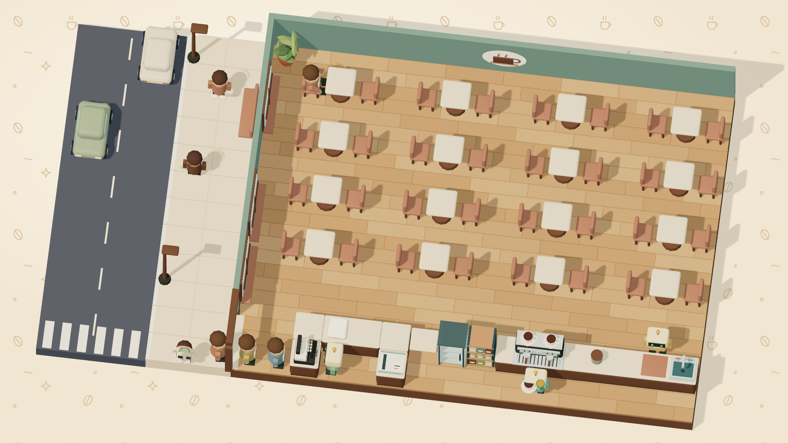
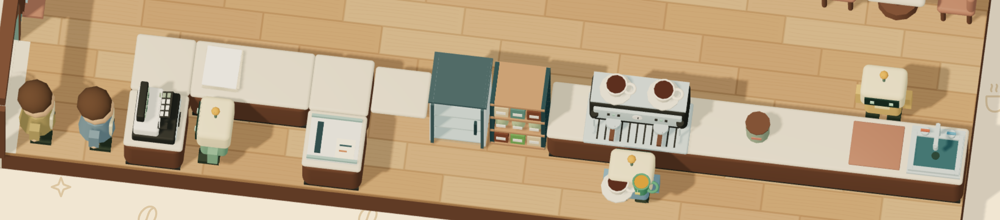

# Cutscene prompts

Prompts for the 56 stills of the 7 story cutscenes. Each still fills the
screen while its lines play in the dialogue box, and it crossfades to the next
still when the story moves on. The scenes and their lines live in
`src/data/campaign/cutscenes.ts`; the story is in `story.md`.

Save each image as `assets/cutscenes/<scene>/<nn>.png` (a `.jpg` works too),
numbered from `01` in the order it plays, for example
`assets/cutscenes/the-keys/03.png`. Then run `python3 tools/cutscenes.py` to
make the WebPs the game loads. Until a still exists, the game shows a prune
placeholder card with the panel's description, so the scenes can be played
before the art is done.

## Workflow for a consistent set

1. **Anchor the places first.** Generate these four stills before anything
   else, and regenerate them until they are exactly right. Every other still
   reuses one of them as a reference.
   - **Café interior:** `the-keys/03` (dark, chairs up) sets the room. Then make
     a bright daytime version from it for `the-scrapyard/01`, and reuse that one
     for every daytime interior.
   - **Café exterior:** `the-keys/01` (rainy evening) sets the shopfront. Make
     `the-keys/09` (sunny morning) from it.
   - **Back room:** `the-scrapyard/06` sets the workbench and the three
     charging docks.
   - **Scrapyard:** `the-scrapyard/04` sets the junk piles and the sunset.
2. **Attach the characters.** The portraits in `assets/portraits/` are the
   character sheet: every still reuses them, and nobody is redesigned. Each
   still lists its **Attach** files. Attach every portrait named there, paste
   the matching lines from [The cast](#the-cast) after the place block, and
   add: _“The characters must match the attached reference portraits exactly:
   face, hair, clothes, colours and outline style. Only the pose, the
   expression and the camera angle change.”_ When a character is worried,
   happy or surprised and that mood has its own portrait, attach it next to
   the neutral one.
3. **Attach the place.** Attach the place reference listed under **Attach**
   (an anchor still, or the 3D captures below for the anchors themselves) and
   add:
   _“Same room, same furniture and colours as the attached scene reference.
   New camera angle and lighting as described.”_
4. **Check a scene in a row.** Put a scene's stills side by side. The light, the
   palette and the outline weight should read as one sequence. Redo any still
   that stands out.

## 3D café references

Two captures of the café as the game draws it, in
[`cutscene_references/`](cutscene_references/). They show the real furniture,
layout and colours. Attach them when you generate the interior anchors
(`the-keys/03`, `the-scrapyard/01`) and the shopfront (`the-keys/01`), and add:
_“Match the furniture, layout and colours of the attached top-down game
capture, drawn at eye level in the style described.”_ They are seen from above,
so borrow what's in the room, not the camera angle.

**`cafe-overview.png`**: the whole café and its street. The street runs along
the left, with an asphalt road, a zebra crossing, cars, a pale pavement,
walnut street lamps and a clay bench against the windows. Inside are rows of
square tables with clay chairs, the round mural on the back wall, a plant in the
corner, and the long counter along the front.

**`cafe-counter.png`**: the counter up close, from the door to the sink. In
order: the cash register, a stack of tickets, the order screen, the glass
fridge, the teal shelf of jars, the espresso machine with two cups on top, the
sugar canister, a terracotta chopping board and the teal sink. Query stands at
the register, Brew at the machine and Porter by the sink.

To make new captures, run the game with reduced motion and pixel art turned
off, open the home page and hide the menu ticket. The café behind it keeps the
cleanest view, with no grid or floor labels.

## Technical spec (for every image)

- **16:9 landscape, 2560 × 1440 px** (at least 1920 × 1080). Anything that
  isn't 16:9 is cropped around the centre.
- The game shows each still whole, as a photo print with a white border laid on
  a dark table above the dialogue box, so the full frame counts. Keep a few
  percent of margin on every edge all the same.
- No text anywhere in the picture unless the prompt asks for it (a name plate,
  a calendar word, a note). Keep any text short and simple.
- Save as PNG, with no transparency and no border.

## Style block (paste at the start of every prompt)

> Cozy visual-novel background scene, a wide 16:9 cinematic still in clean
> cel-shaded 2D illustration. Bold, even, dark espresso-brown outlines
> (#392b24) around characters and furniture, slightly thinner lines for
> background details. Flat colour fills with one soft cel shadow tone and one
> small highlight per material; no gradients except in the sky and light
> glows, no textures, no painterly brushwork, no photorealism, no 3D-render
> look, no pixel art. Friendly, rounded, slightly chunky shapes and
> proportions, with heads about 15% larger than realistic and simple,
> expressive eyes. Warm, muted palette built around cream #fffcf4, espresso
> ink #392b24 and coffee brown #71452f. Mood: cozy modern neighbourhood café,
> gentle humour, a warm animated-film storyboard. No text, no logo, no
> watermark, no border, no letterbox bars.

## The places

Paste the matching block after the style block, before the still's own prompt.

### Café interior

> The café is small, modern and cozy (not retro, not industrial). Sage-grey
> walls (#78968c), a light oak parquet floor, and big street windows with
> walnut frames and clay-coloured sills. A wide sliding glass door onto the
> street. On the wall, a simple round mural: a sand-coloured circle with a
> walnut coffee cup and clay-red steam. Walnut (#70503d) counters with sand
> (#e6d8bf) tops and a charcoal (#393b36) plinth, in one long run along the
> front of the room. Square sand tables with softly rounded corners, each on a
> single round walnut pedestal, with clay (#aa7965) upholstered chairs on two
> sides. On the counter: a modern two-group espresso machine with a charcoal
> body, a brushed-steel front and drip tray, steel group heads with walnut
> portafilter handles, a round cream pressure gauge, small mint status lights
> and a row of cups on top (not brass, not copper, not vintage); a
> charcoal-and-cream cash register with a small green display and a stack of
> order tickets beside it; a sage sugar canister with a walnut lid; a small
> ticket tray at the handoff; a terracotta chopping board and a teal sink at
> the far end. A glass-front drinks fridge, a tall teal shelf with oak shelves
> and glass jars of beans, and a terracotta pot with a leafy green plant in
> the corner.

### Café exterior and street

> A small neighbourhood café shopfront: big windows with walnut frames and
> clay-coloured sills, a wide sliding glass door, sage-grey walls. A pale sand
> pavement with a cream kerb, walnut street lamps with warm bulbs, and a
> clay-red bench against the shopfront. A quiet asphalt street with a zebra
> crossing and a small rounded car or two parked along it. A second storey
> above the café with a small lit window (a flat upstairs). Across the street,
> a narrow house with a little porch.

### Back room

> The café's small back room: a sturdy walnut workbench under a single hanging
> lamp, scattered screwdrivers, wires and a thick, battered repair manual,
> three coffee cups. Against the sage-grey wall, three matching charging docks
> for robots: low cream platforms with a small mint light each, empty and a
> little dusty. A pegboard of tools, a cardboard box of spare parts.

### Scrapyard

> A friendly, colourful scrapyard at the edge of town: soft hills of old
> toasters, kettles, vending machines, a faded jukebox, bicycle wheels and
> broken café parasols. Not grim or rusty-dark; the junk is sun-faded pastel.
> A chain-link fence and a small hand-painted gate.

## The cast

Paste the line for each character in the still after the place block, and
attach their portrait. The portraits win over these words if they ever
disagree.

### People

- **Niko** (`niko`): a young man with messy, wavy dark-brown hair, warm brown
  skin, light stubble, a small silver hoop earring and a faint grease smudge on
  one cheek. A cream henley shirt with the sleeves pushed up, under a
  terracotta canvas apron with dark-brown straps and brass rivets; a pencil and
  a small screwdriver in the apron's chest pocket.
- **Moka** (`moka`): an older, stout woman with light-brown skin, heavy dark
  eyebrows and a wry, unimpressed look. Grey hair in a big, loose bun with a
  pencil pushed through it. A cream henley with rolled sleeves, a faded burn
  scar on one forearm, and a worn rust-brown canvas apron with dark straps; her
  brass-handled tamper sticks out of the apron's front pocket. Often holds a
  small espresso cup on a saucer.
- **Pip** (`pip`): a boy of about twelve with messy ginger hair, freckles, a
  sticking plaster on one cheek and a big gap-toothed grin. A dark-brown and
  cream baseball cap worn backwards, a dusty-pink polo shirt, a cream apron
  with dark-brown straps, and a striped cream tea towel over one shoulder.
- **Mr. Albert** (`albert`): an elderly man with white hair, a white
  moustache and round tortoiseshell glasses. A brown tweed flat cap, a taupe
  cardigan over a white shirt with a knitted brown tie, and a folded newspaper
  under his arm.
- **Juno** (`juno`): a student with dark curly hair in a messy bun with a
  pencil stuck through it, dark-brown skin, freckles and a small silver hoop
  earring. A big periwinkle-blue hoodie with a little green leaf pin, cream
  headphones around the neck, and a cream mug of tea with the tag hanging out.
- **Dot** (`dot`): a round-faced woman with short dark curly hair streaked
  with grey, a mauve headband, rosy cheeks and little sugar-cube earrings. A
  mauve polka-dot cardigan over a cream blouse with a round collar; often
  holds a single sugar cube between two fingers.
- **Rosa** (`rosa`): long wavy auburn hair with dark sunglasses pushed up on
  top, gold hoop earrings and a big open smile. A rust-orange jacket over a
  cream-and-black striped top; often holds up a phone showing a long list.

### Robots

All the café robots are the same model, and each keeps its own colours and
kit. Attach the portrait of every robot in the still.

> Each robot has a wide, boxy, rounded-corner cream (#f1dfb5) head, wider than
> the body and a little scuffed, with a round speaker-grille ear on each side,
> a dark-green (#263f37) visor screen showing two small glowing mint (#b6e4bc)
> eyes, and a thin antenna with a round amber (#e1a251) bulb. A short dark
> neck, a boxy torso with chunky rounded shoulders, brown leather suspender
> straps with brass buttons, simple blocky arms and short dark-olive legs
> (#4b5543).

- **Query** (`query`): sage-green (#80a889) body, a small brass name plate
  on the chest, and a brown leather pocket holding a notepad and a pencil.
  Square eyes.
- **Brew** (`brew`): steel-blue (#7d9eae) body, a coffee-stained yellow apron
  with a brown coffee bean on it, a striped tea towel over one shoulder, and a
  silver steam wand on a hose at its side. Tall, narrow eyes.
- **Porter** (`porter`): honey-gold (#d4ac6b) arms and a cream chest with a
  brass name plate, a brown bow tie, and a silver serving tray held level at
  shoulder height. Square eyes.

## 1 · The Keys (`the-keys`, before shift 1)

Aunt Lou’s last card brings Niko her café, seven months late.

### `the-keys/01` · Exterior, rainy evening

**Attach:** `portraits/niko/neutral.png`. Place: `cutscene_references/cafe-overview.png`.

> Place: café exterior. A rainy evening, deep blue light, the street lamps
> glowing warm on the wet pavement. The café is closed and dark, with its
> blinds half down. Niko stands on the pavement in front of it in a rain
> jacket over his usual clothes (no apron), a suitcase at his feet, looking up
> at the shopfront. In one hand he holds a ring of old keys and in the other a
> seaside postcard (a sunny beach with a white lighthouse), an opened padded
> envelope tucked under his arm. Medium-wide shot from across the street, with
> Niko right of centre and the shopfront filling the upper frame. Quiet, a
> little lonely, hopeful.

### `the-keys/02` · The postcard

**Attach:** `portraits/niko/neutral.png`. Place: `the-keys/01`.

> Place: café exterior, same rainy evening, extreme close-up. Niko’s hand
> holds a seaside postcard, writing side up: a few short lines of loose
> handwriting (unreadable squiggles, no real words) and a stamp with a small
> lighthouse. Raindrops spot the card and blur the ink a little. Behind it,
> the dark shopfront is soft and out of focus, one street lamp glowing. Keep
> the card in the upper centre. Quiet and sad, but warm.

### `the-keys/03` · Inside, in the dark (interior anchor)

**Attach:** `portraits/niko/neutral.png`. Place: `cutscene_references/cafe-overview.png`, `cutscene_references/cafe-counter.png`.

> Place: café interior. Night, the lights off. Blue streetlight falls through
> the big windows in long stripes across the floor. The clay chairs are upside
> down on the round tables. Niko, still in his rain jacket, is pulling a large
> pale dust sheet off the espresso machine on the counter, and dust floats in
> the light. The steel front of the machine and its round cream gauge catch
> the streetlight. Wide shot from the dining room toward the counter, with the
> machine centre-right in the upper half. Expression: surprised and a bit
> moved.

### `the-keys/04` · The ticket spike

**Attach:** `portraits/niko/neutral.png`. Place: `the-keys/03`.

> Place: café interior, same dark room as the reference, close-up on the
> counter by the cash register. A metal ticket spike holds a thin stack of old
> order tickets; the top one is handwritten in neat, strict, slanted
> handwriting (squiggles, no readable words) with a small date circled in the
> corner. Dust on the counter, a cold cup beside the spike. Blue streetlight
> from the windows, Niko’s hand and flashlight just entering the frame. Still
> life, keep the spike centre-top. Curious and a little eerie.

### `the-keys/05` · A shape in the doorway

**Attach:** `portraits/niko/neutral.png`, `portraits/moka/neutral.png`. Place: `the-keys/03`.

> Place: café interior, same dark room as the reference. Night, heavy rain.
> The wide sliding door behind Niko has just opened. In the doorway stands a
> dark, stout silhouette under an umbrella, backlit by the orange street lamp,
> rain streaking around it; no face visible, only the outline and a bun of
> hair. In the foreground on the right, Niko has spun round in panic and holds
> a portafilter up like a weapon, eyes wide. Low angle from behind the
> counter, with the silhouette centred in the upper frame and Niko on the
> right. A spooky-but-funny moment, not horror.

### `the-keys/06` · Moka steps in

**Attach:** `portraits/niko/neutral.png`, `portraits/moka/neutral.png`. Place: `the-keys/03`.

> Place: café interior, one warm lamp now switched on over the counter. Moka
> has stepped inside and is shaking out her dripping umbrella, wearing a long
> raincoat over her rust-brown apron, deeply unimpressed, one eyebrow raised.
> Niko stands at the right, sheepishly lowering the portafilter. Rain still
> streaks the windows behind them. Medium shot, with Moka centre and Niko
> right, both faces in the upper half.

### `the-keys/07` · Post’s slow round here

**Attach:** `portraits/niko/neutral.png`, `portraits/moka/neutral.png`. Place: `the-keys/03`.

> Place: café interior, one warm lamp over the counter, rain on the windows.
> Niko, still in his rain jacket, holds the seaside postcard out toward Moka.
> Moka, in her raincoat and rust-brown apron, glances at it and looks away to
> the side, one hand pushed deep into her apron pocket. Medium two-shot across
> the counter, with Niko left and Moka right, both faces in the upper half.
> Awkward and quietly guilty; Moka is hiding something.

### `the-keys/08` · Cups on the left

**Attach:** `portraits/niko/neutral.png`, `portraits/moka/neutral.png`. Place: `the-keys/03`.

> Place: café interior, the teal shelf behind the counter, one warm lamp on.
> Moka briskly slides a row of white cups along the shelf to its left end,
> very precise. Niko stands beside her with a cup in each hand, watching, a
> bit lost. Medium shot, with the shelf and Moka’s hands in the upper centre.
> Dry humour.

### `the-keys/09` · Pip at the window

**Attach:** `portraits/niko/neutral.png`, `portraits/moka/neutral.png`, `portraits/pip/neutral.png`. Place: `the-keys/01`.

> Place: café exterior, the next morning, bright sun, the pavement drying.
> Seen from inside the café looking out through the big window: Pip (see his
> has his nose and both hands pressed against the glass, grinning, cap on
> backwards. Inside, in the foreground right, Moka stands with her arms
> crossed and a coffee cup, and Niko, now in his terracotta apron, leans in
> curiously. The upstairs flat's door is visible beside the café entrance.
> Cheerful and bright.

### `the-keys/10` · Welcome aboard

**Attach:** `portraits/niko/neutral.png`, `portraits/moka/neutral.png`, `portraits/pip/neutral.png`. Place: `the-scrapyard/01`.

> Place: café interior, the next morning, bright sun through the windows, the
> chairs now down. Pip proudly carries a tall, wobbly stack of empty cups
> toward the counter, grinning. Niko, in his terracotta apron, laughs and
> holds out a hand to shake. Moka leans on the counter behind with her arms
> crossed and a small, hidden smile. Medium-wide shot, with Pip centre-left
> and Niko right. Cheerful.

## 2 · The Scrapyard (`the-scrapyard`, before shift 3)

Too many tickets for one pair of hands, and the robot Moka threw out.

### `the-scrapyard/01` · After the rush

**Attach:** `portraits/niko/neutral.png`, `portraits/moka/neutral.png`. Place: `the-keys/03` and `cutscene_references/cafe-overview.png`, `cutscene_references/cafe-counter.png`.

> Place: café interior, late afternoon, warm light (the daytime interior
> anchor). After the rush: Niko slumps forward on the counter, cheek on his
> arms, under a comically tall pile of handwritten order tickets that spills
> over the cash register. Behind him, Moka sweeps the floor with a broom, not
> looking at him. Medium shot of the counter, with Niko centre and the ticket
> mountain in the upper frame. Tired and funny.

### `the-scrapyard/02` · A robot?

**Attach:** `portraits/niko/neutral.png`, `portraits/moka/neutral.png`. Place: `the-scrapyard/01`.

> Place: café interior, late afternoon, the daytime interior. Niko has sat
> bolt upright behind the counter, tickets sliding off him, eyes wide. In
> front of the counter, Moka has stopped sweeping and leans on her broom,
> looking away toward the window, jaw set. Medium two-shot, with Niko right
> and Moka left, both faces in the upper half. Surprised versus stubborn.

### `the-scrapyard/03` · The gate

**Attach:** `portraits/niko/neutral.png`. Place: `the-scrapyard/04`.

> Place: scrapyard, at sunset, a peach and lilac sky. Niko pushes an empty
> wooden wheelbarrow through the small hand-painted gate in the chain-link
> fence, looking up at the junk hills ahead: toasters, vending machines, a
> faded jukebox. Wide shot from inside the yard looking back at the gate, with
> Niko small in the centre and the sky filling the top. Adventurous.

### `the-scrapyard/04` · The scrapyard (scrapyard anchor)

**Attach:** `portraits/niko/neutral.png`, `portraits/query/neutral.png`. Place: none (scrapyard anchor).

> Place: scrapyard, at sunset, a peach and lilac sky. Niko pushes a wooden
> wheelbarrow along a path between the junk hills. On the right, a cream, boxy
> robot head pokes out of a pile of old toasters and kettles, its visor dark,
> and a small pale-yellow name plate is visible beside it. Niko has stopped
> and is leaning forward, surprised. Wide shot, with the robot head upper
> right and the sky filling the top.

### `the-scrapyard/05` · Past the porch

**Attach:** `portraits/niko/neutral.png`, `portraits/moka/neutral.png`, `portraits/query/neutral.png`. Place: `the-keys/01`.

> Place: street at dusk, the street lamps coming on. Niko wheels the
> wheelbarrow along the pavement with the cream robot head and body piled in
> it, a tarp half over them. Across the street, on the little porch of the
> narrow house, Moka stands with her arms crossed under a porch light,
> watching him go by. Wide shot, with Niko right of centre and Moka small on
> the left, in the upper half. Quiet tension.

### `the-scrapyard/06` · Two in the morning (back room anchor)

**Attach:** `portraits/niko/neutral.png`, `portraits/query/neutral.png`. Place: none (back room anchor).

> Place: back room, two in the morning, the single hanging lamp is the only
> light. Query lies open on the workbench: its sage-green torso panel is off
> and its wires are showing, its cream head resting to one side with the visor
> dark. The battered manual is open, with three empty coffee cups. Against the
> wall, the three empty charging docks. Niko is bent over the robot with a
> screwdriver, sleeves rolled up, a smear of grease on his cheek. Medium-wide
> shot, with the bench centre and the docks upper left. Quiet and focused.

### `the-scrapyard/07` · Query wakes

**Attach:** `portraits/niko/neutral.png`, `portraits/query/neutral.png`. Place: `the-scrapyard/06`.

> Place: back room, close-up. Query's visor lights up, two glowing mint
> rectangular eyes, and the mint glow spills onto Niko's face beside it. Niko
> smiles, tired and delighted. Everything else is in soft shadow. Close
> two-shot, with Query's head left of centre in the upper half and Niko's face
> right. A tender, magical moment.

### `the-scrapyard/08` · Hello, Query

**Attach:** `portraits/niko/neutral.png`, `portraits/query/neutral.png`. Place: `the-scrapyard/06`.

> Place: back room, two in the morning, the hanging lamp. Query sits up on the
> workbench, visor lit with two mint eyes, and reaches out a blocky hand to
> shake Niko’s outstretched one. Niko is tired, grease on his cheek, and
> grinning. The three charging docks behind; the first one now glows mint.
> Medium two-shot, with the handshake centre and both faces in the upper half.
> Warm and a little funny.

## 3 · A Second Pair of Hands (`a-second-pair-of-hands`, before shift 15)

Query earns its badge, and Moka won’t have a robot in Lou’s kitchen.

### `a-second-pair-of-hands/01` · Employee of the Month

**Attach:** `portraits/niko/neutral.png`, `portraits/albert/neutral.png`, `portraits/query/neutral.png`. Place: `the-scrapyard/01`.

> Place: café interior, daytime. A framed photo hangs on the sage wall next to
> the mural: Query proudly wearing a round gold "Employee of the Month" badge
> (just a star on it, no readable text). In front of the wall, the real Query
> stands polishing the same badge on its chest while Mr. Albert (see his sits
> at a round table and applauds warmly. Niko grins behind the counter. Medium
> shot, with the photo and Query centre-top.

### `a-second-pair-of-hands/02` · The usual

**Attach:** `portraits/albert/neutral.png`, `portraits/query/neutral.png`. Place: `the-scrapyard/01`.

> Place: café interior, morning, the counter. Query, badge on its chest, holds
> a plain cup of coffee out across the counter with both hands. Mr. Albert
> takes it, beaming, hat in his other hand. Medium two-shot, with the cup
> centre and both faces in the upper half. Sweet.

### `a-second-pair-of-hands/03` · Snowing tickets

**Attach:** `portraits/moka/neutral.png`, `portraits/query/neutral.png`. Place: `the-scrapyard/01`.

> Place: café interior, the counter and the kitchen handoff. The ticket tray
> at the handoff is overflowing and paper tickets spill over the counter and
> flutter to the floor like snow. Behind the espresso machine, Moka is half
> buried in tickets, glaring, one hand still pulling a shot. Query stands at
> the register on the left, still printing tickets happily. Medium-wide shot,
> with Moka centre-right. Chaotic and funny.

### `a-second-pair-of-hands/04` · Not in Lou’s kitchen

**Attach:** `portraits/niko/neutral.png`, `portraits/moka/neutral.png`. Place: `the-scrapyard/01`.

> Place: café interior, the doorway from the kitchen to the back room. Niko,
> inside the back room, points at the two empty charging docks against the
> wall. In the doorway, Moka stands with her arms firmly crossed, tickets
> still stuck to her apron, blocking the way. Medium shot, with Moka centre in
> the doorway and the docks visible past her. Stubborn, a little funny.

### `a-second-pair-of-hands/05` · Before Moka was up

**Attach:** `portraits/niko/neutral.png`, `portraits/query/neutral.png`. Place: `the-keys/01`.

> Place: street, grey-blue dawn, the street lamps still on. Niko tiptoes along
> the pavement pushing the wooden wheelbarrow, with Query sitting in it, a
> finger to his lips. Across the street, Moka’s porch and windows are dark,
> curtains closed. Wide shot, with Niko and Query right of centre and the dark
> house on the left, all in the upper half. Sneaky and comic.

### `a-second-pair-of-hands/06` · A sibling under the tarp

**Attach:** `portraits/niko/neutral.png`, `portraits/query/neutral.png`, `portraits/brew/neutral.png`. Place: `the-scrapyard/04`.

> Place: scrapyard, at midday under a pale blue sky. Query rides in the wooden
> wheelbarrow that Niko pushes. In front of them, a tarp has been pulled back
> to reveal a steel-blue robot (Brew) curled up, hugging an old broken
> espresso machine with both arms, its visor dark. Query leans out of the
> wheelbarrow, eyes lit. Wide shot, with Brew and the tarp centre-right in the
> upper half.

### `a-second-pair-of-hands/07` · Brew wakes up

**Attach:** `portraits/niko/neutral.png`, `portraits/moka/neutral.png`, `portraits/brew/neutral.png`. Place: `the-scrapyard/06`.

> Place: back room, morning. Brew sits up on the workbench, visor bright with
> two tall mint eyes, arms raised in excitement. Niko stands beside it with a
> screwdriver, pleased. In the doorway on the right, Moka leans on the frame
> with her arms crossed, suspicious. Two of the three charging docks now glow
> mint. Medium-wide shot.

### `a-second-pair-of-hands/08` · Not ninety-one

**Attach:** `portraits/niko/neutral.png`, `portraits/moka/neutral.png`, `portraits/brew/neutral.png`. Place: `the-scrapyard/01`.

> Place: café interior, the espresso machine, morning. Moka stands beside the
> machine, tapping its round cream pressure gauge with one finger, lecturing.
> Brew leans in very close, visor eyes wide, taking it all in. Niko grins
> behind them with a cup. Medium shot, with Moka and Brew centre and the gauge
> in the upper half. The first thaw.

## 4 · Ninety-Two Degrees (`ninety-two-degrees`, before shift 22)

Moka's last morning in the kitchen, and the truth about the card.

### `ninety-two-degrees/01` · The last polish

**Attach:** `portraits/moka/neutral.png`. Place: `the-scrapyard/01`.

> Place: café interior at dawn, before opening, soft pink-gold light through
> the big windows, the chairs still up on the tables. Moka stands alone at the
> espresso machine, polishing its brushed-steel front with a cream cloth, her
> face gentle for once. Nobody else in the room. Medium shot from the side,
> with Moka and the machine in the upper centre. Quiet and bittersweet.

### `ninety-two-degrees/02` · The empty pocket

**Attach:** `portraits/moka/neutral.png`. Place: `the-scrapyard/01`.

> Place: café interior at dawn, pink-gold light, close-up. Moka’s hand rests
> in the pocket of her worn rust-brown canvas apron, the pocket flat and
> empty. The polishing cloth hangs from her other hand, the steel of the
> espresso machine soft behind. Still, intimate, no face visible. Keep the
> hand and pocket in the upper centre.

### `ninety-two-degrees/03` · Niko at the door

**Attach:** `portraits/niko/neutral.png`, `portraits/moka/neutral.png`, `portraits/brew/neutral.png`. Place: `the-scrapyard/01`.

> Place: café interior at dawn, from behind Moka at the espresso machine. In
> the doorway to the kitchen, Niko has just arrived with Brew beside him, both
> stopped in their tracks. Moka does not turn round; we see her back and her
> bun. Medium-wide shot, with Moka in the foreground left and Niko and Brew in
> the doorway upper right. Quiet, something is about to be said.

### `ninety-two-degrees/04` · Seven months

**Attach:** `portraits/niko/neutral.png`, `portraits/moka/neutral.png`. Place: `the-scrapyard/01`.

> Place: café interior, early morning, by the espresso machine. Moka sits on a
> wooden stool, shoulders down, looking at her hands, suddenly tired and
> older. Niko sits on an upturned crate across from her, leaning in,
> listening. The chairs are still up on the tables behind. Medium two-shot,
> with both faces in the upper half. Gentle and sad.

### `ninety-two-degrees/05` · A shot like hers

**Attach:** `portraits/niko/neutral.png`, `portraits/moka/neutral.png`, `portraits/brew/neutral.png`. Place: `the-scrapyard/01`.

> Place: café interior, the espresso machine. Brew holds a portafilter under
> the group head; a small espresso cup steams on the drip tray. Moka lifts a
> matching small cup to her lips, eyes closed, face softening. Niko watches
> from behind, holding his breath. Medium close shot, with Moka’s face and the
> cup in the upper centre. A quiet turning point.

### `ninety-two-degrees/06` · The tamper

**Attach:** `portraits/niko/neutral.png`, `portraits/moka/neutral.png`, `portraits/query/neutral.png`, `portraits/brew/neutral.png`. Place: `the-scrapyard/01`.

> Place: café interior, early morning, by the espresso machine. Moka holds out
> her old brass tamper to Brew, who takes it carefully in both hands, eyes
> softened. Niko and Query stand close behind, watching; Niko looks worried
> and touched. Medium shot, with the hand-over centre-top.

### `ninety-two-degrees/07` · The apron on the hook

**Attach:** `portraits/moka/neutral.png`. Place: `the-scrapyard/01`.

> Place: café interior, the kitchen door. Close-up of Moka's worn rust-brown
> canvas apron hanging on a wooden hook by the kitchen door. A small paper
> note is pinned to it with "92°" handwritten on it. Morning light, a little
> steam drifting past from the machine out of frame. Still life, no people.
> Keep the apron in the upper centre.

### `ninety-two-degrees/08` · The porch across the street

**Attach:** `portraits/moka/neutral.png`, `portraits/brew/neutral.png`. Place: `the-keys/01`.

> Place: street, late morning. Seen from the pavement, Moka sits in a wooden
> chair on the little porch of the narrow house across from the café, with a
> cup and saucer in hand and a blanket over her knees. She watches the café
> window across the street, where the espresso machine and Brew are visible
> inside. Wide shot, with Moka left of centre in the upper half and the café
> window on the right. Warm, content, a little funny.

## 5 · The Floor Robot (`the-floor-robot`, before shift 23)

School starts soon, and Pip doesn't want a robot on his floor.

### `the-floor-robot/01` · Table four!

**Attach:** `portraits/pip/neutral.png`, `portraits/rosa/neutral.png`, `portraits/query/neutral.png`, `portraits/brew/neutral.png`. Place: `the-scrapyard/01`.

> Place: café interior, a packed lunchtime. Pip runs between the tables with
> three trays balanced on his arms and head, cap flying. At a big table on the
> right, Rosa and a group of friends wave him over. Query and Brew are busy at
> the counter behind. Wide shot, with Pip centre in the upper half,
> mid-stride. Busy and funny.

### `the-floor-robot/02` · Rosa’s table

**Attach:** `portraits/pip/neutral.png`, `portraits/rosa/neutral.png`. Place: `the-scrapyard/01`.

> Place: café interior, a packed lunchtime. A big table of friends, with Rosa
> at the head, all waving and holding up empty cups. Pip spins toward them
> with a tray, a cup on top wobbling mid-tip. Medium-wide shot, with the table
> on the right and Pip left, both in the upper half. Busy and funny.

### `the-floor-robot/03` · The calendar

**Attach:** `portraits/pip/neutral.png`. Place: `the-scrapyard/01`.

> Place: café interior, close-up on the wall by the kitchen door. A paper wall
> calendar with the last days of August crossed off and one day circled in red
> with the single word "SCHOOL". Pip's hand is at the edge of the frame,
> touching the circled day. Still life. Keep the calendar centre-top.

### `the-floor-robot/04` · No way

**Attach:** `portraits/niko/neutral.png`, `portraits/pip/neutral.png`. Place: `the-scrapyard/06`.

> Place: back room, afternoon. Pip stands in the doorway with his arms folded
> and his cap pulled low, scowling. Behind him on the wall, two charging docks
> glow mint and the third sits empty and dusty. Niko is at the workbench,
> eyebrows raised. Medium shot, with Pip centre and the empty dock visible
> behind him. Stubborn but cute.

### `the-floor-robot/05` · To prove it

**Attach:** `portraits/niko/neutral.png`, `portraits/pip/neutral.png`. Place: `the-scrapyard/04`.

> Place: scrapyard, late afternoon under a golden sky. Pip marches through the
> hand-painted gate ahead of everyone, chin up, fists at his sides. Behind
> him, Niko pushes the wooden wheelbarrow, amused. Wide shot, with Pip centre
> in the upper half and the junk hills around. Comic determination.

### `the-floor-robot/06` · Under the parasol

**Attach:** `portraits/niko/neutral.png`, `portraits/pip/neutral.png`, `portraits/porter/neutral.png`. Place: `the-scrapyard/04`.

> Place: scrapyard, in the late afternoon under a golden sky. Under a broken,
> faded café parasol sits a honey-gold robot (Porter), visor dark, still
> holding a silver tray perfectly level at shoulder height. Pip kneels in
> front of it with pleading eyes and clasped hands, and Niko stands behind
> with the wheelbarrow, smiling. Wide shot, with Porter and the parasol
> centre-right.

### `the-floor-robot/07` · A clean visor

**Attach:** `portraits/niko/neutral.png`, `portraits/pip/neutral.png`, `portraits/porter/neutral.png`. Place: `the-scrapyard/04`.

> Place: scrapyard, golden late light. Pip kneels beside the honey-gold robot
> under the broken parasol, polishing its dusty visor with his cleaning cloth,
> tongue out in concentration. The robot still holds its tray level. Niko tips
> the wheelbarrow down behind them, ready to load. Medium shot, with Pip and
> the robot in the upper centre. Tender.

### `the-floor-robot/08` · Three docks, three robots

**Attach:** `portraits/niko/neutral.png`, `portraits/pip/neutral.png`, `portraits/query/neutral.png`, `portraits/brew/neutral.png`, `portraits/porter/neutral.png`. Place: `the-scrapyard/06`.

> Place: back room, evening. All three charging docks glow mint. Porter has
> just woken up on the middle one, raising its tray high, bright tilted eyes.
> Query and Brew stand on the other docks and lean in to greet it. Niko and
> Pip watch from the workbench, delighted. Wide shot, with the three robots in
> a row in the upper two thirds. Warm and triumphant.

## 6 · Back to School (`back-to-school`, before shift 31)

Pip's first day of school, and Niko's first day as just the owner.

### `back-to-school/01` · Everybody’s names

**Attach:** `portraits/pip/neutral.png`, `portraits/juno/neutral.png`, `portraits/porter/neutral.png`. Place: `the-scrapyard/01`.

> Place: café interior, early evening, a few regulars at their tables. Pip
> crouches beside Porter and points across the room at Juno (see the, who sits
> with her laptop and a cup of tea. Porter holds a little notepad on its tray
> and writes with a stubby pencil, visor eyes focused. Medium shot, with Pip
> and Porter left and Juno right, all in the upper half. Sweet and funny.

### `back-to-school/02` · Goodbye at the door

**Attach:** `portraits/pip/neutral.png`, `portraits/query/neutral.png`, `portraits/brew/neutral.png`, `portraits/porter/neutral.png`. Place: `the-scrapyard/01`.

> Place: café interior by the sliding door, early morning. Pip stands in the
> doorway with a big school backpack, no apron, cap on the right way round for
> once. The three robots are lined up in front of him to say goodbye: Porter
> in front with its tray lowered sadly, Query and Brew beside it. Medium shot,
> with Pip centre-right and the robots across the upper middle. Bittersweet
> and cute.

### `back-to-school/03` · Off to school

**Attach:** `portraits/pip/neutral.png`, `portraits/porter/neutral.png`. Place: `the-keys/01`.

> Place: street, a sunny morning. Pip runs off down the pavement, looking back
> and waving, backpack bouncing. In the café's open doorway on the left,
> Porter waves back with its tray raised. Wide shot, with Pip in the upper
> right and the street receding. Cheerful.

### `back-to-school/04` · A smooth service

**Attach:** `portraits/niko/neutral.png`, `portraits/query/neutral.png`, `portraits/brew/neutral.png`, `portraits/porter/neutral.png`. Place: `the-scrapyard/01`.

> Place: café interior, mid-morning, sunny, a calm full room. Query takes an
> order at the register, Brew pulls a shot at the espresso machine, Porter
> carries a tray between the tables. Niko stands in the kitchen doorway with
> his arms folded, just watching, pleased. Wide shot, with the three robots
> across the upper middle and Niko on the right. Calm and proud.

### `back-to-school/05` · Cups on the right

**Attach:** `portraits/niko/neutral.png`. Place: `the-scrapyard/01`.

> Place: café interior, the teal shelf behind the counter. Niko, alone, slides
> the row of white cups along the shelf from the left end to the right, with a
> small, satisfied smile. Medium shot, with the shelf and Niko’s hands in the
> upper centre. A tiny rebellion.

### `back-to-school/06` · Two aprons

**Attach:** `portraits/niko/neutral.png`, `portraits/moka/neutral.png`. Place: `the-scrapyard/01`.

> Place: café interior, by the kitchen door. Niko hangs his terracotta apron
> on the hook right next to Moka's old rust-brown one (still with its 92°
> note). He is in a plain cream shirt now, smiling, a little proud. Medium
> close shot, with the two aprons and Niko's face in the upper half.

## 7 · Closing Time (`closing-time`, after the last shift)

The café runs itself, and Lou's card goes up on the wall. This scene plays
before the final receipt.

### `closing-time/01` · A full café at sunset

**Attach:** `portraits/albert/neutral.png`, `portraits/juno/neutral.png`, `portraits/dot/neutral.png`, `portraits/rosa/neutral.png`, `portraits/query/neutral.png`, `portraits/brew/neutral.png`, `portraits/porter/neutral.png`. Place: `the-scrapyard/01`.

> Place: café interior at sunset, golden light pouring through the big
> windows. Every table is full: Mr. Albert with his newspaper, Juno on a
> laptop with tea, Dot with her sugar cubes, and Rosa's group laughing (see
> their portraits). Query takes an order at the register, Brew works the
> espresso machine, and Porter carries a tray between the tables. Wide
> establishing shot, busy but calm, with everyone in the upper two thirds.

### `closing-time/02` · Goodnight

**Attach:** `portraits/albert/neutral.png`, `portraits/juno/neutral.png`, `portraits/dot/neutral.png`, `portraits/porter/neutral.png`. Place: `the-scrapyard/01`.

> Place: café interior at sunset, the sliding door. Porter holds the door open
> with one arm, tray raised in the other. Mr. Albert tips his hat on the way
> out, and Juno and Dot wave behind him. Medium shot, with the doorway centre
> and everyone in the upper half. Warm.

### `closing-time/03` · Old habits

**Attach:** `portraits/niko/neutral.png`, `portraits/query/neutral.png`. Place: `the-scrapyard/01`.

> Place: café interior, the counter, dusk. Niko sits on the customer side of
> the counter with a cup of coffee he made himself, smiling. Query leans over
> from behind the register, visor eyes tilted in curiosity, looking at the
> cup. Medium two-shot, with both faces in the upper half.

### `closing-time/04` · Not in instruction set

**Attach:** `portraits/niko/neutral.png`, `portraits/query/neutral.png`. Place: `the-scrapyard/01`.

> Place: café interior, the counter, dusk, close-up. Query slides a tiny
> printed ticket across the counter next to Niko’s cup; the ticket has just a
> small coffee cup doodle on it. Niko’s hand rests by the cup, and Query’s
> visor eyes are tilted. Keep the ticket and cup in the upper centre. Funny
> and sweet.

### `closing-time/05` · Everyone comes by

**Attach:** `portraits/niko/neutral.png`, `portraits/moka/neutral.png`, `portraits/pip/neutral.png`. Place: `the-scrapyard/01`.

> Place: café interior at dusk, the doorway and the counter. Moka has come
> over from across the street and stands at the espresso machine, tasting a
> shot from a small cup, approving. Pip, just back from school with his
> backpack still on, wipes a table with his cloth, grinning. Niko laughs at
> the counter. Medium-wide shot, with Moka centre-left and Pip right.

### `closing-time/06` · It’s your café

**Attach:** `portraits/niko/neutral.png`, `portraits/moka/neutral.png`. Place: `the-scrapyard/01`.

> Place: café interior at dusk, the teal shelf behind the counter, the cups
> now on its right end. Moka stands in front of the shelf, looking at the
> cups, unreadable. Beside her, Niko hovers, nervous, rubbing the back of his
> neck. Medium two-shot, with the shelf and both faces in the upper half. A
> held breath before a smile.

### `closing-time/07` · The old machine

**Attach:** `portraits/niko/neutral.png`, `portraits/moka/neutral.png`. Place: `the-scrapyard/01`.

> Place: café interior at night, warm lamp light, by the sage wall near the
> counter. Niko pins Lou’s seaside postcard (from `the-keys/01`) to the wall
> beside the framed group photo. Moka stands at his shoulder, looking at the
> card, her face soft for once. Medium two-shot from the side, with the card
> and both faces in the upper half. Tender.

### `closing-time/08` · The photo and the postcard

**Attach:** `portraits/niko/neutral.png`, `portraits/moka/neutral.png`, `portraits/pip/neutral.png`, `portraits/query/neutral.png`, `portraits/brew/neutral.png`, `portraits/porter/neutral.png`. Place: `the-scrapyard/01`.

> Place: café interior, close-up on the sage wall by the counter at night,
> warm lamp light. A framed group photo: Niko, Moka, Pip and the three robots
> posing in front of the espresso machine, with Pip on Porter's shoulders.
> Pinned beside it, Lou's postcard from `the-keys/01` (a sunny seaside with a
> white lighthouse), a little creased, with short handwriting on it. Still
> life, no people. Keep the frame and the postcard centre-top.

## File checklist

| Scene                    | Files                                             |
| ------------------------ | ------------------------------------------------- |
| `the-keys`               | `01` `02` `03` `04` `05` `06` `07` `08` `09` `10` |
| `the-scrapyard`          | `01` `02` `03` `04` `05` `06` `07` `08`           |
| `a-second-pair-of-hands` | `01` `02` `03` `04` `05` `06` `07` `08`           |
| `ninety-two-degrees`     | `01` `02` `03` `04` `05` `06` `07` `08`           |
| `the-floor-robot`        | `01` `02` `03` `04` `05` `06` `07` `08`           |
| `back-to-school`         | `01` `02` `03` `04` `05` `06`                     |
| `closing-time`           | `01` `02` `03` `04` `05` `06` `07` `08`           |
